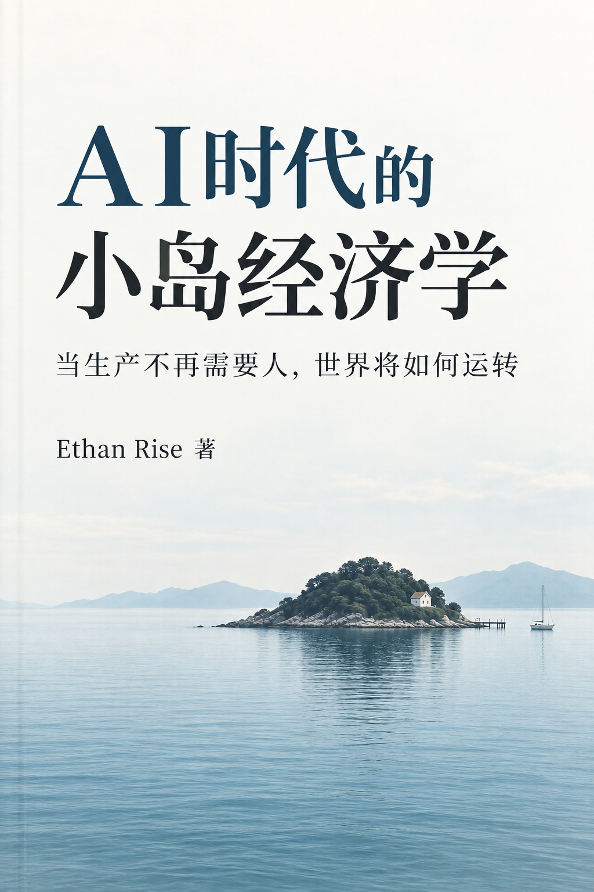

# AI时代的小岛经济学

## 当生产不再需要人，世界将如何运转

**作者：Ethan Rise**  
**版本：2026年9月**

这是一本以“小岛社会”为思想实验的通俗经济学与未来社会推演作品。

我们假设有一座只有约1000人的岛。最初，岛民靠捕鱼、种地、运输、制造、零售、医疗、教育和各种服务维持生活。随着 AI、机器人、无人驾驶、自动工厂、智能电网和自主系统逐步进入这个社会，单位产出所需要的直接人类劳动开始持续下降。

故事不从技术参数开始，而从岛上发生的一件件事情开始：第一台智能机器出现，岗位结构变化，几乎无人的公司出现，停电暴露能源约束，芯片和算力成为瓶颈，AI 能力开始影响生产率，商品越来越丰富，而劳动收入与生产增长之间原本紧密的联系逐渐松动。

这些变化最终把小岛推向一个核心问题：

> **当智能本身成为生产力，而生产越来越少依赖人的直接劳动，人类长期建立在“劳动—收入—消费”之上的经济体系会发生什么？**

## 本书讨论什么

- AI 如何从工具逐渐成为直接参与生产的智能能力；
- 能源、芯片、算力、AI、机器人/自动化系统如何组成新的生产体系；
- 自动化为何可能同时带来更高产能、更少直接人类劳动和新的收入问题；
- 当工资的重要性下降，居民通过什么渠道获得购买力和收益权；
- 基本收入、全民智能资本、公共 AI 等制度工具分别解决什么问题；
- 当稀缺从标准化商品转向土地、位置、时间、注意力、信任和真实经历，市场会怎样变化；
- 当工作不再必须承担全部谋生功能，人如何重新理解职业、成功和时间。

## 主要人物

- **林森**：农场经营者，从生产率和实体产业角度观察自动化；
- **周启**：普通劳动者，从岗位、工资、收入结构与自由时间角度经历整个变化；
- **陈曦**：AI 与自动化创业者，从企业、资本、规模和平台角度观察新生产体系；
- **苏岚**：公共事务治理者，从分配、制度、公共能力与治理角度回应技术变化；
- **韩木、陆远**：承担特定章节功能的配角；
- **“小工”**：故事开端出现的智能机器，也是贯穿全书的象征性非人角色。

## 书稿结构

全书采用小岛思想实验的方式推进。不是先列经济学概念再举例，而是让事件在岛上依次发生，再从人物的选择和后果中引出经济问题。

全书包含：

- 序章；
- 第1～29章；
- 终章。

完整目录见 [`outline.md`](./outline.md)，正文位于 [`chapters/`](./chapters/) 目录。

## 书籍页面

统一规格：**1800 × 2700 px，竖版，2:3，300 DPI**。

- [01 · 封面](./book-pages/01-cover.png)
- [02 · 扉页](./book-pages/02-title-page.png)
- [03 · 版权页](./book-pages/03-copyright-page.png)
- [04 · 题记页](./book-pages/04-epigraph-page.png)
- [05 · 作者简介](./book-pages/05-author-bio-page.png)

相关文字资料位于 [`front-matter/`](./front-matter/) 目录。

## 阅读

建议从 [`chapters/00-preface.md`](./chapters/00-preface.md) 开始顺序阅读。

> 技术可以改变生产，  
> 但如何生活，始终是人的选择。
>
> —— Ethan Rise
